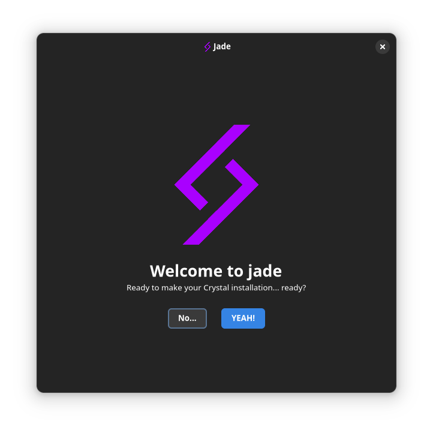

<p align="center">
  <a href="https://github.com/crystal-linux/todo/">
    
  </a>
</p>

<h2 align="center">Jade</h2>

<p align="center">
        <a href="https://github.com/crystal-linux/.github/blob/main/LICENSE">
    <a href="https://github/crystal-linux/jade_gui"></a>
    <a href="https://github/crystal-linux/jade_gui"></a><br>
    <a href="https://twitter.com/intent/user?screen_name=crystal_linux">
    <a href="https://discord.gg/hYJgu8K5aA"> </a>
    <a href="https://github.com/axtloss"><a href="https://github.com/axtloss"></a></a><br>
    <a href="https://fosstodon.org/@crystal_linux">
    <a href="https://twitter.com/crystal_linux"></a>
            <a href="https://stopthemingmy.app/"><br>
</p>

<p align="center"> The libadwaita/gtk based gui installer using jade as the backend.
</p>

<p align="center"><a  href="https://github.com/crystal-linux/demos-mockups/blob/main/preview.pdf">The jade gui mockups</p></a>





### Building
__NOTE: the jade gui libadwaita rewrite is not complete and CAN'T install a crystal system yet__

jade gui relies on a yet unreleased version of libadwaita, that's why you have to use flatpak to build it:

```sh
git clone https://github.com/crystal-linux/jade_gui
cd jade_gui
flatpak-builder --user --install --install-deps-from=flathub --force-clean build-dir al.getcryst.jadegui 
flatpak run al.getcryst.jadegui
```
